## Introduction

This project extends the AWS CDK Pipelines capabilities to support feature branch development. Developers might need a short lived separate development environment provisioned for their own feature development. This project provides the platform which automatically creates a dedicated pipeline and an isolated environment when users create a new branch. It also takes care of tearing down and cleaning up all infrastructure and pipeline when the branch is merged and deleted. This model allows developers to work independently and concurrently which increases development speed and more importantly developers' satisfaction.

This solution follows AWS best practices by adopting a multi-account strategy. To deploy this solution you need 3 AWS accounts:
- CICD: This account contains only deployment pipelines.
- Development account: contains the development and all the feature branches environments workloads.
- Production account: a dedicated account for production work loads.

This project uses a sample serverless application as an example. The application is presented in the [Extended CDK workshop](https://catalog.us-east-1.prod.workshops.aws/workshops/071bbc60-6c1f-47b6-8c66-e84f5dc96b3f/en-US/10-introduction-and-setup#application-architecture
). The application uses dynamodb as a data store. If the user wants to use a relational database instead the project includes a separate RDS pipeline to manage the database provisioning separately if needed.

## Overview of the solution


## How it works

After deploying the pipeline when a developer creates a feature branch, github webhook sends a push message to the lambda function. The function inspects the message and if a new branch was created the function will make a copy of the `template pipeline` and configure it to listen to the new branch. The new branch pipeline then gets triggered and the application resources for that branch will be provisioned in an isolated environment in the development account. Once the developer completes the feature, merges to the main branch, and deletes the feature branch, github webhook sends another delete message to the lambda function which will tear down the dedicated pipeline and application resources in the development account. Notice that the `main` branch has its own pipeline which is configured to deploy directly to the production account.

## Project folder structure

Before setting up the project let's go through the project folder structure and learn more about its CDK constructs and stacks. What we have here is a typical CDK app created using [projen](https://projen.io/). All source code goes under the `src` folder and CDK tests can be found under the `test` folder. The `src` folder contains a simple react application under the `client` folder and the `infra` folder contains the CDK constructs/stacks for the deployment pipelines, solution infrastructure resources, and serverless application resources.

- `./src/infra/app` contains all the application resources in one stack. For example AWS Lambda , API Gateway, CloudFront, DynamoDB, and S3 bucket
- `./src/infra/cicd/app-pipeline-construct.ts` the application pipeline that creates a CDK Pipeline used to provision the application stack under `./src/infra/app`.
- `./src/infra/cicd/database-pipeline-construct.ts` the database construct which creates a separate CDK pipeline that provisions an RDS database in both development and production accounts. Note, The database pipeline also provides a lambda function which uses [Prisma](https://www.prisma.io/) to automatically apply database migrations. If you choose to use the database pipeline you can write your initial database schema migrations under `./src/infra/lambda/prisma/prisma/migrations`. The pipeline will automatically trigger the lambda function which applies the migrations. Moving forward, you can add more migrations which would be applied automatically by the application pipeline where all `feature branches` pipelines migrations would be applied to the development database and migrations mierged to the `main` branch will be applied to the production database.
- `./src/infra/cicd/lambda` contains all the lambda function code used by the serverless application and the infrastructure.
- `./src/infra/script` contains the CDK bootstrapping script
- `./src/infra/shared` contains shared CDK constructs and stacks used to set up the infrastructure.

## Prerequisites

- An [AWS management account](https://aws.amazon.com/free/)
- Create an [organization](https://docs.aws.amazon.com/organizations/latest/userguide/orgs_tutorials_basic.html) with one OU then create thee accounts under it
- It is recommended to [set up IAM identity center](https://youtu.be/_KhrGFV_Npw?si=tyUzpLz4iB72k1XP) for a single sign on for your organization
- [AWS CDK](https://docs.aws.amazon.com/cdk/v2/guide/getting_started.html#getting_started_install) installed

## Initial Setup
- Fork [this repository](https://github.com/hosamshahin/cdk-pipeline-feature-branch) under your name then clone it.
- Install dependency by installing porjen
```sh
npm install projen
```
- login to CICD account and [create a connection](https://docs.aws.amazon.com/codepipeline/latest/userguide/connections-github.html#connections-github-console) to github
- Take note of CICD/DEV/PRD accounts Ids you created previously and update [.projenrc.ts](https://github.com/hosamshahin/cdk-pipeline-feature-branch/blob/main/.projenrc.ts) file. Also update github org, repository name, codeStar connection ARN created in the previous step.
- Run `npx projen` to update project config files
- Commit and push the changes to your repository
- Update your local `~/.aws/credentials` file with the CICD/DEV/PRD accounts credentials. You can get the temporary credentials form the idently center SSO login screen. Expand the CICD/DEV/PRD accounts and select `Command line or programmatic access` then copy the `Short-term credentials` into `~/.aws/credentials` and name the profile cicd/dev/prd.
- Bootstrap your environments by using `./src/infra/script/bootstrap.sh` script


# Provision github webhook stack
The stack contains an api gateway (the webhook URL) backed by a lambda function which manages the feature branches life cycle. It also provides a secret string to secure the webhook endpoint.

- From the root of repository execute this command

```sh
cdk deploy GithubWebhookAPIStack --profile cicd -c TargetStack=GithubWebhookAPIStack
```

After the stack gets deployed navigate to the stack output and copy `secretuuid` and `webhookurl` values.

Go to your github repository and configure the webhook. Under `setting/webhook` click add  webhook. Add the value of `webhookurl` to `payload URL` and the value of `secretuuid` to `Secret` then click `Add webhook`. to check the webhook is working correctly go to the `Recent Deliveries' tab you should see a successful `ping` message.

# Provision CloudFront auth secret in DEV/PRD
This stack creates a secret which will be used to keep Google auth configuration. You need to deploy this stack in DEV/PRD accounts
From the root of repository execute this command

```sh
cdk deploy AuthSecret --profile dev -c TargetStack=AuthSecret
cdk deploy AuthSecret --profile prd -c TargetStack=AuthSecret
```

# Provision database pipeline (optional)
From the root of repository execute this command

```sh
cdk deploy DBPipeline --profile cicd -c TargetStack=DBPipeline
```

# Provision application pipeline
As discussed earlier the application pipeline consists of two separate pipelines created in one CloudFormation stack. `pipeline-prd` is dedicated for production deployment and `pipeline-cicd` is a template pipeline used to create a new pipeline for each feature branch.

From the root of repository execute this command

```sh
cdk deploy Pipeline --profile cicd -c TargetStack=Pipeline
```
After the pipeline stack is provisioned go to [CodePipeline](https://us-east-1.console.aws.amazon.com/codesuite/codepipeline/pipelines?region=us-east-1) you should see two pipelines `pipeline-cicd` which should be failing and this is expected because it is only used as a template. The other pipeline `pipeline-prd` which is monitoring the `main` branch should be running. Wait for the pipeline to reach the approval gate then approve it. Once the pipeline is done, switch to production account and go to CloudFormation you should find a new stack `AppStage-AppStack` created. In the stack output you will find `CfnOutCloudFrontUrl` which holds the application url.

Note: if you have provisioned the database pipeline and you want to continue applying Prisma migrations using the application piepine you need to set the [useRdsDataBase](https://github.com/hosamshahin/cdk-pipeline-feature-branch/blob/main/src/infra/app/app-stack.ts) parameter to `true`

## Configure Google's OAuth 2.0 Application
- Follow the instructions [here](https://developers.google.com/identity/openid-connect/openid-connect#appsetup) to create Google's OAuth 2.0 Application.
- Set the redirect URI to the cloudfront url `CfnOutCloudFrontUrl`/_callback. Make you add `/_callback` at the end of the url.
- Take note of the Google OAuth 2.0 credentials, including a client ID and client secret, to authenticate users and gain access to Google's APIs.
- Generate Public and Private keys
```bash
openssl genrsa -out private.pem 2048
openssl rsa -in private.pem -outform PEM -pubout -out public.pem
awk 'NF {sub(/\r/, ""); printf "%s\\n",$0;}' private.pem;echo
awk 'NF {sub(/\r/, ""); printf "%s\\n",$0;}' public.pem;echo
```
- Update the config below with Google App client ID and client secret, CloudFront distribution and Public/Private key generated above

```json
{
    "AUTH_REQUEST": {
        "client_id": "${GOOGLE_CIENT_ID}",
        "redirect_uri": "https://${CLOUDFRONT_URL}/_callback",
        "response_type": "code",
        "scope": "openid email"
    },
    "TOKEN_REQUEST": {
        "client_id": "GOOGLE_CIENT_ID",
        "redirect_uri": "https://${CLOUDFRONT_URL}/_callback",
        "grant_type": "authorization_code",
        "client_secret": "${GOOGLE_CLIENT_SECRET}"
    },
    "DISTRIBUTION": "amazon-oai",
    "AUTHN": "GOOGLE",
    "PRIVATE_KEY": "${PRIVATE_KEY}",
    "PUBLIC_KEY": "${PUBLIC_KEY}",
    "DISCOVERY_DOCUMENT": "https://accounts.google.com/.well-known/openid-configuration",
    "SESSION_DURATION": 3000,
    "BASE_URL": "https://accounts.google.com",
    "CALLBACK_PATH": "/_callback",
    "AUTHZ": "GOOGLE"
}
```
- Encode the config above to Base64 format with an online tool. Go to the `AuthSecret` stack in DEV/PRD, get the auth secret ARN from the output `CloudfrontAuthSecretArn` then update the secret with the base64 encoded configuration. Note the secret should be a json object in this format
```json
{ "config": "base64EcodedConfig" }

```

## Test the feature branch capability

Create a new branch and name it `featring-testing` then push it to your repository. Open CodePipeline in the CICD account you should see a new pipeline with a name [feature-testing-FeatureBranchPipeline](https://us-east-1.console.aws.amazon.com/codesuite/codepipeline/pipelines/feature-testing-FeatureBranchPipeline/view?region=us-east-1) created. Wait until the pipeline completes execution, switch to the DEV account and you should see a new stack named `feature-testing-AppStage-AppStack` created.

Delete the feature branch locally and form the remote repository, go to the CodePipeline in CICD account you will find the feature branch pipeline deleted. check the DEV account the CloudFormation stack for that branch should be deleted as well.

Note: In order for the lambda function to create a new pipeline for a feature branch the branch name should start with `feature-`|`hotfix-`|`bug-`. You can change that behavior by modifying `branchPrefix`` attribute in [github-webhook-api-stack](https://github.com/hosamshahin/cdk-pipeline-feature-branch/blob/main/src/infra/shared/github-webhook-api-stack.ts)


## Infrastructure snapshot testing and using CDK-nag
This project adopts the snapshot testing strategy. Under the `test` folder you will find test files for the main CDK stacks/constructs. All snapshots are generated under the `__snapshots__` folder. Any time you make a change to the app/infra stacks/constructs you need to update the snapshots otherwise the deployment will fail. It is always a good practice to keep your snapshots changes as part of your team code review process.

To update a test snapshot use the following command
```sh
npm run test:update -- app-stack.test.ts
npm run test:update -- cross-account-auth-secret.test.ts
npm run test:update -- github-webhook-api-stack.test.ts
npm run test:update -- prisma-stack.test.ts
```

make sure before you push any changes to run the snapshot test locally `npm run test` to avoid pipeline failures.

This project uses [cdk-nag](https://github.com/cdklabs/cdk-nag) for infrastructure security checks and best practices. Make sure to mitigate cdk-nag errors/warnings either by solving or suppressing the issue. See test files for more details.

## Cleanup

Simply delete all CloudFormation stacks in CICD/DEV/PRD accounts.

## Known issue

If you are using a new CICD account for this solution you might find the application pipeline is failing due to codeBuild limited run concurrency. You can get around this issue by retrying the failed steps. But it is recommended to use [AWS Service Quotas](https://us-east-1.console.aws.amazon.com/servicequotas/home?region=us-east-1#
) to submit a request to increase the `Concurrently running builds for Linux/Small environment` to 10.

## References
- The multi branch pipeline was inspired by @wolfgangunger work [here](https://github.com/wolfgangunger/cdk-codepipeline-multibranch).
- The details of how to use Prisma in a lambda function can be found [here](https://github.com/aws-samples/prisma-lambda-cdk).
- You can find the sample serverless app used as a demo [here](https://github.com/aws-samples/extended-cdk-workshop-coffee-listing-app).
- A good reference for [Github webhook impelentation](https://github.com/cloudcomponents/cdk-constructs/tree/master/examples/github-webhook-example).
- An [example](https://github.com/aws-samples/lambdaedge-openidconnect-samples) on how to use lamada@Edge to integrate with an OIDC provider.